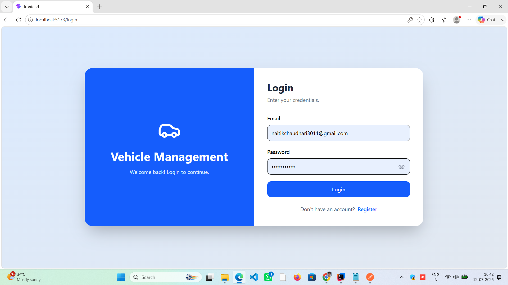
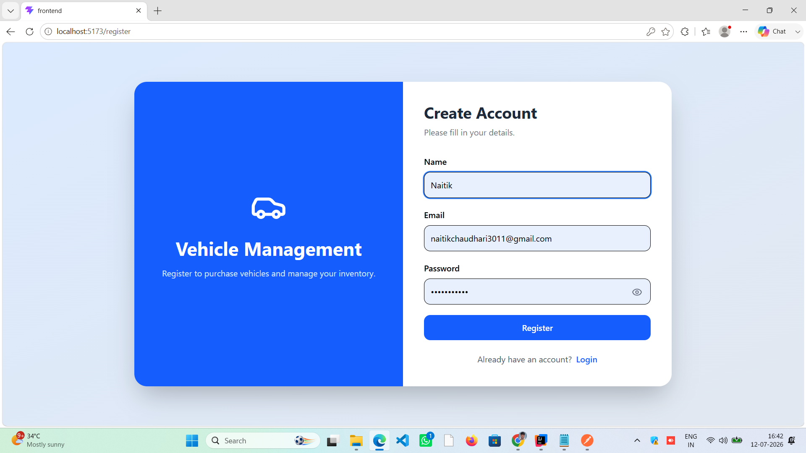
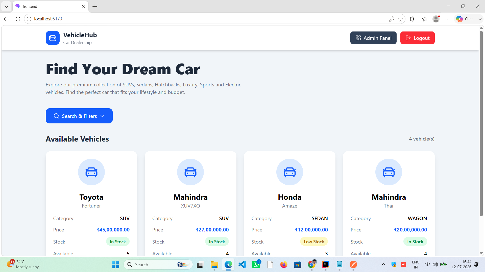
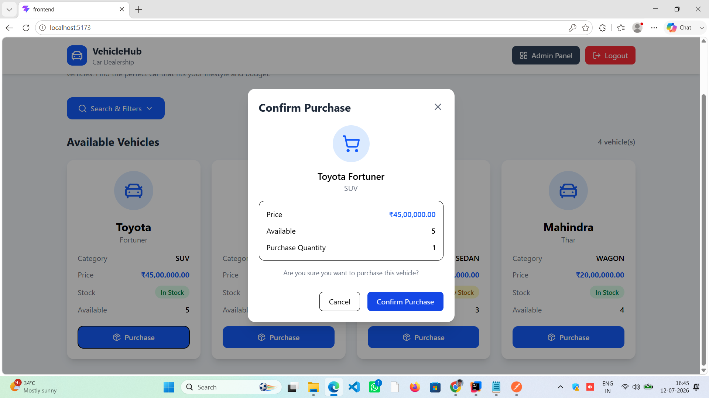
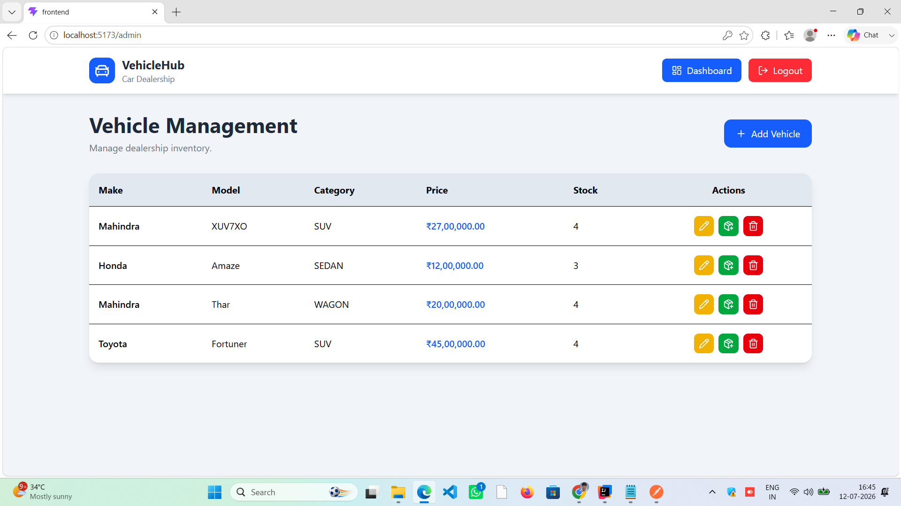
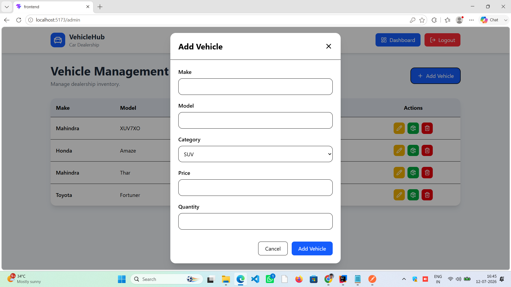
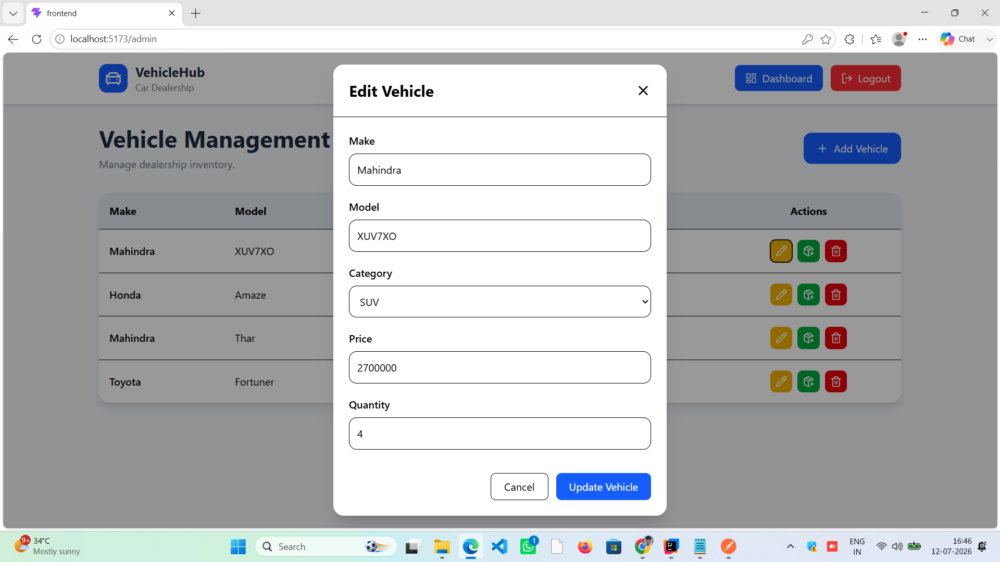
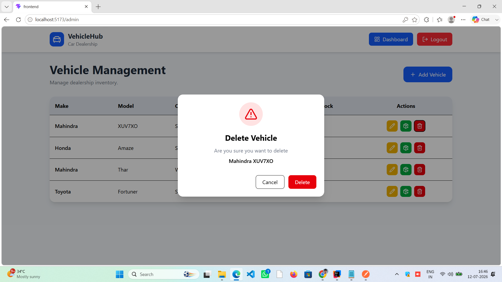
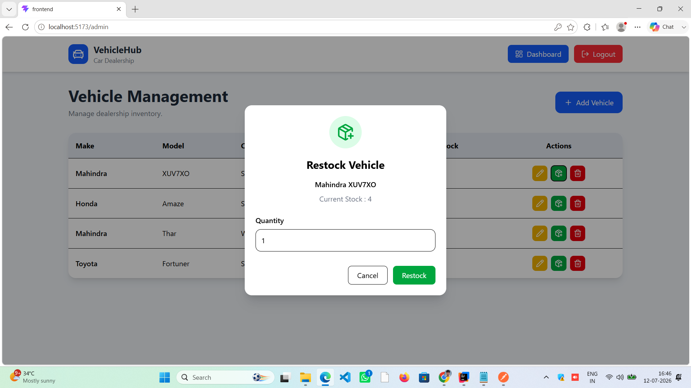

# 🚗 Car Dealership Inventory System

A full-stack Car Dealership Inventory System that allows users to browse, search, and purchase vehicles while enabling administrators to manage inventory through a secure dashboard.

The project consists of a **Spring Boot REST API** backend and a **React** frontend with JWT-based authentication and role-based authorization.

The backend was developed following the **Test-Driven Development (TDD)** methodology.

---

# Features

## Authentication

- User Registration
- User Login
- BCrypt Password Encryption
- JWT Authentication
- Role-Based Authorization (ADMIN / USER)

---

## User Features

- View all available vehicles
- Search vehicles by:
  - Make
  - Model
  - Category
  - Price Range
- Purchase vehicle
- Purchase confirmation dialog
- Dynamic inventory updates
- Responsive dashboard

---

## Admin Features

- Add Vehicle
- Update Vehicle
- Delete Vehicle
- Restock Vehicle
- Secure Admin Dashboard
- Role-Based Route Protection
- Inventory Management Table
- Reusable CRUD Modals

---

## Validation & Error Handling

- Jakarta Bean Validation
- Global Exception Handling
- Standardized API Error Responses
- Frontend Form Validation
- Toast Notifications

---

## Security

- JWT Authentication
- Stateless Session Management
- Spring Security
- Role-Based Endpoint Authorization
- Protected React Routes

---

# Tech Stack

## Backend

- Java 21
- Spring Boot
- Spring Security
- Spring Data JPA
- Hibernate
- PostgreSQL
- JWT (JJWT)
- Maven
- Lombok
- JUnit 5
- Mockito
- MockMvc

---

## Frontend

- React
- Vite
- React Router DOM
- Axios
- Tailwind CSS
- React Hook Form
- React Hot Toast
- Lucide React
- JWT Decode

---

# Architecture

```
                  React Frontend
                        │
                        ▼
                 REST API (Spring Boot)
                        │
        JWT Authentication & Authorization
                        │
                        ▼
                  Service Layer
                        │
                        ▼
                  Repository Layer
                        │
                        ▼
                   PostgreSQL Database
```

---

# Project Structure

```
car-dealership-inventory-system

backend/
│
├── src/
│   ├── config
│   ├── controller
│   ├── dto
│   ├── entity
│   ├── exception
│   ├── repository
│   ├── security
│   ├── service
│   ├── specification
│   └── test
│
├── pom.xml
└── ...

frontend/
│
├── src/
│   ├── api
│   ├── components
│   ├── pages
│   ├── utils
│   ├── assets
│   ├── App.jsx
│   └── main.jsx
│
├── package.json
└── vite.config.js
```

---

# REST API

## Authentication

| Method | Endpoint | Access |
|---------|----------|--------|
| POST | `/api/auth/register` | Public |
| POST | `/api/auth/login` | Public |

---

## Vehicles

| Method | Endpoint | Access |
|---------|----------|--------|
| GET | `/api/vehicles` | Public |
| GET | `/api/vehicles/search` | Public |
| POST | `/api/vehicles` | ADMIN |
| PUT | `/api/vehicles/{id}` | ADMIN |
| DELETE | `/api/vehicles/{id}` | ADMIN |

---

## Inventory

| Method | Endpoint | Access |
|---------|----------|--------|
| POST | `/api/vehicles/{id}/purchase` | Authenticated |
| POST | `/api/vehicles/{id}/restock` | ADMIN |

---

# Search Examples

Search by make

```
GET /api/vehicles/search?make=Toyota
```

Search by model

```
GET /api/vehicles/search?model=Fortuner
```

Search by category

```
GET /api/vehicles/search?category=SUV
```

Search by price range

```
GET /api/vehicles/search?minPrice=1000000&maxPrice=5000000
```

Search using multiple filters

```
GET /api/vehicles/search?make=Toyota&category=SUV
```

---

# Running the Backend

## Clone Repository

```bash
git clone https://github.com/Naitik-Chaudhari/car-dealership-inventory-system.git
```

Navigate to backend

```bash
cd backend
```

Configure PostgreSQL

```properties
spring.datasource.url=jdbc:postgresql://localhost:5432/car_dealership

spring.datasource.username=YOUR_USERNAME

spring.datasource.password=YOUR_PASSWORD

spring.jpa.hibernate.ddl-auto=update

jwt.secret=YOUR_SECRET_KEY

jwt.expiration=86400000
```

Install dependencies

```bash
mvn clean install
```

Run

```bash
mvn spring-boot:run
```

Backend runs at

```
http://localhost:8080
```

---

# Running the Frontend

Navigate to frontend

```bash
cd frontend
```

Install dependencies

```bash
npm install
```

Run development server

```bash
npm run dev
```

Frontend runs at

```
http://localhost:5173
```

---

# Screenshots

## Login Page



---

## Register Page



---

## User Dashboard



---

## Purchase Confirmation



---

## Admin Dashboard



---

## Add Vehicle



---

## Edit Vehicle



---

## Delete Vehicle



---

## Restock Vehicle



---

# Testing

The backend was developed using **Test-Driven Development (TDD)**.

## Test Suite

- Authentication Controller Tests
- Vehicle Controller Tests
- Service Layer Tests
- Repository Tests
- JWT Utility Tests
- Security Tests
- Validation Tests

Run tests

```bash
mvn test
```

## Test Report

All backend tests pass successfully.

## UserService Test


## VehicleService Test


## VehicleController Test


## JwtService Test


## JwtAuthenticationFilter Test


---

# Development Methodology

The backend was developed using the **Test-Driven Development (TDD)** approach.

For every feature:

1. Write a failing test (Red)
2. Implement the minimum code (Green)
3. Refactor while keeping all tests passing (Refactor)

---

# My AI Usage

## AI Tools Used

- ChatGPT (Primary AI Assistant)

---

## How I Used AI

I used ChatGPT throughout the development process as a technical assistant. Specifically, I used it to:

- Brainstorm the project architecture and component structure.
- Discuss REST API design and frontend integration.
- Generate boilerplate React components and reusable modal components.
- Design responsive user interfaces using Tailwind CSS.
- Debug issues related to Spring Security, JWT authentication, CORS, routing, and API integration.
- Improve frontend state management and reusable component design.
- Generate meaningful Git commit messages following conventional commit standards.
- Review code structure and suggest improvements for maintainability.
- Improve project documentation and README formatting.

Every AI-generated suggestion was reviewed, tested, and modified where necessary before being integrated into the project.

---

## Reflection

Using AI significantly improved my development workflow by reducing time spent on repetitive coding tasks and helping explore implementation ideas more efficiently.

Rather than replacing my understanding of the project, AI acted as a development assistant that accelerated problem-solving, code organization, debugging, and documentation. All generated code was manually reviewed, tested, and adapted to meet the project requirements.

---

# Future Enhancements

- Vehicle Image Upload
- Pagination
- Sorting
- Purchase History
- User Profile
- Refresh Token Authentication
- Docker Support
- Swagger / OpenAPI Documentation
- CI/CD Pipeline
- Email Notifications

---

# Author

**Naitik Chaudhari**

GitHub

https://github.com/Naitik-Chaudhari

Email

naitikchaudhari3011@gmail.com
